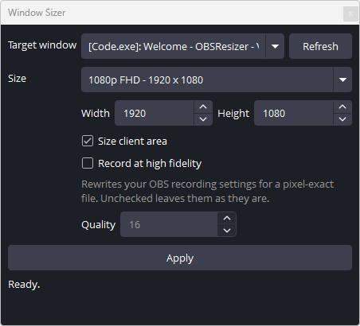

# obs-window-sizer

**Capture a window in OBS at exactly 1:1 — no letterboxing, no rescaling, no soft text.**

[](LICENSE)
[](https://github.com/TGoodhew/obs-window-sizer/releases)


Pick a window, pick a size, press Apply. The plugin resizes the window to that
exact number of **physical** pixels and sets the OBS canvas to match, so the
capture is pixel-for-pixel with no resampling anywhere in the chain.

<p align="center">
  
</p>

## Why this is not just typing numbers into two boxes

Two things make matching a window to a canvas harder than it looks:

- **Windows lies about window size.** Since Windows 10 every window carries an
  invisible resize border and drop shadow, so `GetWindowRect` reports a
  rectangle larger than what you see — usually 7px per side. Size a window to
  "1920 wide" the obvious way and the visible window is 1906.
- **Display scaling makes "pixels" ambiguous.** OBS captures physical pixels. At
  150% scaling a window Windows calls 1920x1080 is physically 2880x1620.

This plugin measures the real visible frame with the compositor's own
`DWMWA_EXTENDED_FRAME_BOUNDS`, works entirely in physical pixels, and corrects
for both. See [how it works](docs/how-it-works.md).

## Requirements

- **Windows x64.** Windows only — it uses Win32 window management directly.
- **OBS Studio 32.x.** Built against **32.2.2**. OBS refuses plugins built
  against a newer libobs, and a different major version can crash OBS at load,
  so match the major version.
- An NVIDIA GPU is needed only for the optional recording configuration;
  everything else works on any GPU.

The plugin checks the OBS version at startup. On a **newer OBS major** than it
was built for it disables itself and says so in a dialog rather than risking a
crash. On an **older** one, OBS refuses to load it at all and writes
`compiled with newer libobs` to the log - that check belongs to OBS and happens
before any plugin code runs.

## Install

1. Download `obs-window-sizer-<version>-windows-x64.zip` from
   [Releases](https://github.com/TGoodhew/obs-window-sizer/releases).
2. **Close OBS Studio.**
3. Extract the zip into `%ProgramData%\obs-studio\plugins\`. Paste
   `%ProgramData%` into the Explorer address bar to get there — the folder is
   hidden by default. You should end up with
   `...\plugins\obs-window-sizer\bin\64bit\obs-window-sizer.dll`.
4. Start OBS and turn the dock on: **Docks → Window Sizer**.

No elevation needed, and it survives OBS updates.

> `%APPDATA%\obs-studio\plugins\` is **not** searched on Windows — that is the
> macOS/Linux path, and a plugin there is silently ignored.

Full detail, the alternative Program Files location, verification and uninstall:
[deployment.md](docs/deployment.md).

## Using it

1. **Target window** — pick from the list, or press **Refresh** if the window
   appeared since. The list comes from OBS's own Window Capture source, so it
   matches that dropdown exactly. Minimised windows are excluded.
2. **Size** — choose a preset or type your own. The preset box follows what you
   type and shows *Custom* when nothing matches.
3. **Size client area** — on, the content area hits the target size. Off, the
   visible window frame does, title bar and borders included. The capture source
   is always set to agree.
4. **Apply.**

| Preset | Pixels |
|---|---|
| 720p HD | 1280 x 720 |
| 1080p FHD | 1920 x 1080 |
| 1440p 2K QHD | 2560 x 1440 |
| 2160p 4K UHD | 3840 x 2160 |
| Vertical | 1080 x 1920 |
| Square | 1080 x 1080 |

These are **physical** pixels, and a window cannot be made larger than the
display it is on — asking for 4K on a 1440-tall monitor will be refused at the
height, and the status line will say what it settled at instead.

The status line always reports what was actually achieved versus what was
requested. Applications with a minimum size or a fixed aspect ratio will refuse,
and you are told rather than left to discover it later. Either way the canvas
follows the size the window really reached, so the capture stays 1:1.

### Record at high fidelity

Optional. Ticking it makes Apply also point OBS's recording at NVIDIA NVENC HEVC
at constant quality, with the recording rescale switched off so the file is
exactly the window size. **It does not start a recording — OBS's own Record
button still does that.**

Leave it unchecked and your recording settings are not touched, though the dock
still warns if they would rescale the recording away from the canvas.

It is near-lossless rather than lossless: OBS records 4:2:0 colour, which
softens coloured text edges slightly. Psycho-visual AQ is deliberately turned
off, because it smears static UI text.

## What it changes in your OBS

Worth knowing, since it edits real settings rather than keeping its own:

| When | What |
|---|---|
| Every Apply | Canvas base and output resolution, in the running session **and** the profile |
| Every Apply | The Window Capture source's target window and client-area option |
| Every Apply | That source's scene item transform — position 0,0, scale 1.0, no bounds, no crop |
| Only with "Record at high fidelity" | `recordEncoder.json` and the recording keys in your profile; switches Simple output mode to Advanced, which needs one OBS restart |

Apply is refused outright while recording or streaming, and the target window is
left alone in that case.

## Documentation

| | |
|---|---|
| [Deployment](docs/deployment.md) | Where plugins live, `deploy.ps1`, verifying, uninstalling |
| [Building](docs/building.md) | Prerequisites, the build, VS Code, rebuilding after an OBS update |
| [How it works](docs/how-it-works.md) | Drop shadows, DPI, why the window list and recording config are done the way they are |
| [Troubleshooting](docs/troubleshooting.md) | Symptoms, causes, and what to include in a bug report |

## Known limitations

- The DPI handling is only well tested at 100% scaling on a single monitor
  ([#5](https://github.com/TGoodhew/obs-window-sizer/issues/5)).
- Only the main canvas is handled; OBS 32 multi-canvas is ignored
  ([#9](https://github.com/TGoodhew/obs-window-sizer/issues/9)).
- With several Window Capture sources in a scene, the first is used without
  asking ([#10](https://github.com/TGoodhew/obs-window-sizer/issues/10)).
- The dock does not remember its settings between sessions
  ([#4](https://github.com/TGoodhew/obs-window-sizer/issues/4)).
- Some text in the dock is still clipped
  ([#7](https://github.com/TGoodhew/obs-window-sizer/issues/7)).

- **English only.** Localisation is out of scope - the UI strings live in
  `data/locale/en-US.ini`, but status and error messages are hardcoded English,
  so a translation would be half a job. Please do not start one expecting it to
  be merged ([#14](https://github.com/TGoodhew/obs-window-sizer/issues/14)).

All open work is on the [issue tracker](https://github.com/TGoodhew/obs-window-sizer/issues).

## Building

```powershell
cmake --preset windows-x64
cmake --build --preset windows-x64
pwsh -File .\deploy.ps1
```

The first configure downloads about 1 GB and builds libobs from source. Full
instructions in [building.md](docs/building.md).

## Licence

MIT — see [LICENSE](LICENSE), with third-party notices in
[THIRD-PARTY-NOTICES.md](THIRD-PARTY-NOTICES.md).

Two caveats worth stating plainly:

- `cmake/**`, `src/plugin-support.h` and `src/plugin-support.c.in` are retained
  from obs-plugintemplate and remain **GPL-2.0-or-later**. They are not covered
  by the MIT grant.
- The plugin links libobs and obs-frontend-api, which are GPL-2.0-or-later. MIT
  is GPL-compatible so this source can carry it, but a **compiled binary**
  distributed together with libobs is still subject to the GPL.
